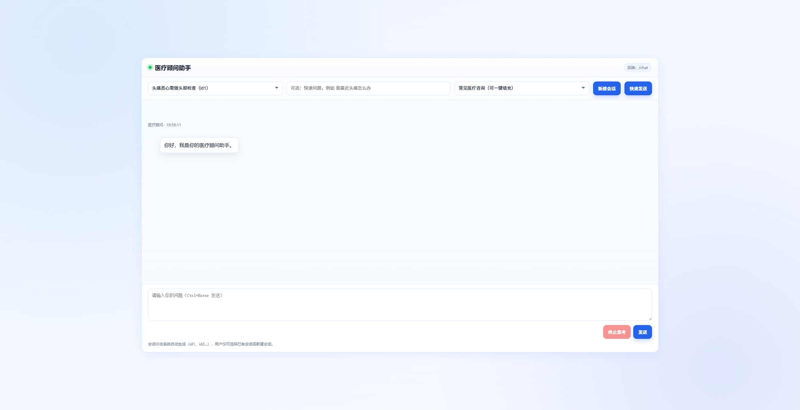
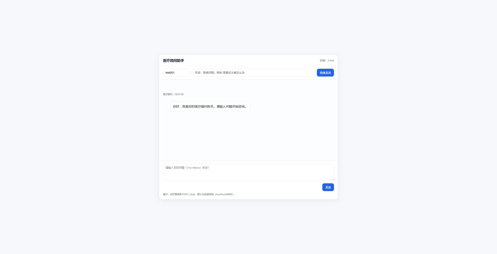

# consultant · 医疗问答助手

一个基于 **Spring Boot + LangChain4j + DeepSeek + RAG** 的医疗咨询演示项目。  
支持会话管理、会话标题概括、常见问题快速咨询、思考中断与现代化前端交互。

---

## ✨ 项目简介

本项目实现了一个可运行的医疗问答系统：

- **后端能力**：
  - 提供 `/chat` 问答接口
  - 提供 `/sessions` 会话管理接口（仅系统生成 `id1/id2/...`）
  - 参数校验 + 全局异常处理
  - RAG 文档检索增强
- **AI 能力**：
  - DeepSeek 问答生成
  - 会话首问自动生成“会话概括标题”（展示给用户）
- **前端能力**：
  - 会话选择/新建会话
  - 常见医疗咨询下拉一键填充
  - 终止思考按钮（可取消当前请求）
  - 思考动画与聊天界面美化

> 注意：本项目用于学习与演示，不能替代线下专业诊疗。

---

## 🖼️ 界面截图

### 主界面（当前版本）



### 历史界面（对比图）



---

## 🧱 技术栈

- **Java 17**
- **Spring Boot 3.4.x**
- **LangChain4j**
- **DeepSeek（OpenAI 兼容接口）**
- **Maven Wrapper**
- 前端：原生 HTML/CSS/JavaScript（静态资源）

---

## 🚀 快速启动

### 方式 1：一键启动（推荐）

双击项目根目录：

- `one-click-start.bat`（英文名）
- 或 `一键启动.bat`（中文名）

脚本会：
1. 启动后端服务
2. 自动打开前端页面 `http://localhost:8080/index.html`

### 方式 2：命令行启动

```bash
./mvnw spring-boot:run
```

Windows:

```bash
.\mvnw.cmd spring-boot:run
```

---

## ⚙️ 配置说明

`application.yml` 中 API Key 支持两种环境变量名：

```yml
api-key: ${API_KEY:${API-KEY:}}
```

建议优先使用：`API_KEY`

---

## 📡 API 概览

### 1) 获取会话列表

`GET /sessions`

返回示例：

```json
[
  { "sessionId": "id1", "title": "头痛伴恶心处理建议" }
]
```

### 2) 新建会话

`POST /sessions`

返回示例：

```json
{ "sessionId": "id2" }
```

### 3) 聊天咨询

`POST /chat`

请求体：

```json
{
  "sessionId": "id1",
  "message": "最近反复头痛并伴有恶心，是否需要就医？"
}
```

响应：文本内容（医疗问答结果）

---

## 📁 代码结构

```text
consultant/
├─ src/
│  ├─ main/
│  │  ├─ java/org/example/consultant/
│  │  │  ├─ ConsultantApplication.java           # 启动入口
│  │  │  ├─ config/CommonConfig.java             # LLM/RAG/Memory 配置
│  │  │  ├─ controller/ChatController.java       # /chat /sessions 接口
│  │  │  ├─ session/SessionService.java          # 会话管理（id递增、标题维护）
│  │  │  ├─ dto/
│  │  │  │  ├─ ChatRequest.java                  # 聊天请求体
│  │  │  │  └─ SessionView.java                  # 会话展示对象
│  │  │  ├─ exception/GlobalExceptionHandler.java# 全局异常处理
│  │  │  └─ Aiservice/
│  │  │     ├─ ConsultantService.java            # 主问答 AI Service
│  │  │     └─ SessionTitleService.java          # 会话标题概括 AI Service
│  │  └─ resources/
│  │     ├─ application.yml                      # 配置文件
│  │     ├─ system.txt                           # 系统提示词
│  │     ├─ static/index.html                    # 前端页面
│  │     └─ content/                             # RAG 文档目录
│  └─ test/
│     └─ java/org/example/consultant/
│        └─ ConsultantApplicationTests.java      # 启动测试
├─ docs/assets/
│  ├─ ui-main.png                                # 当前界面截图
│  └─ ui-legacy.png                              # 历史界面对比图
├─ one-click-start.bat                           # 一键启动
├─ start-all.bat                                 # 启动脚本
├─ stop-all.bat                                  # 停止脚本
├─ pom.xml
├─ mvnw / mvnw.cmd
└─ README.md
```

---

## 🧪 测试与构建

```bash
.\mvnw.cmd -DskipTests package
.\mvnw.cmd test
```

---

## 📌 后续可优化方向

- 持久化会话与标题（数据库）
- 持久化向量库（替代 InMemory）
- 增加接口鉴权与限流
- 增加前端主题切换与会话搜索
- 增加更完整的单元测试/集成测试
